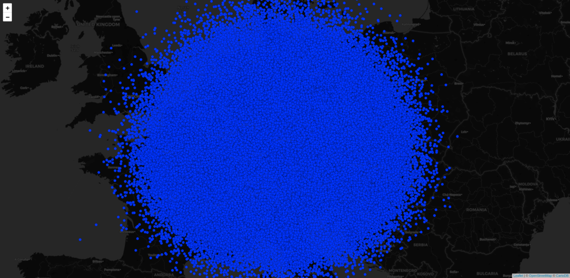
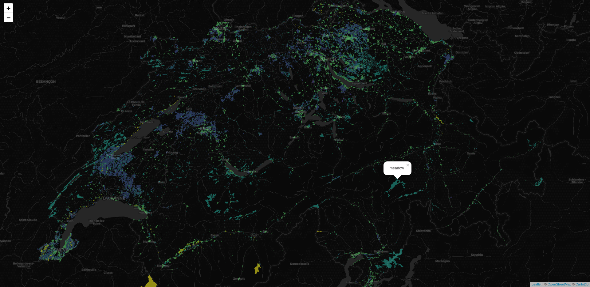

# leafgl - performant WebGL rendering for leaflet

[](https://travis-ci.org/r-spatial/leafgl)
[](https://www.rpackages.io/package/leafgl)
[](https://www.rpackages.io/package/leafgl)
[](https://cran.r-project.org/package=leafgl)
[](https://CRAN.R-project.org/package=leafgl)

An R package for fast web gl rendering of features on leaflet maps. It’s
an R port of <https://github.com/robertleeplummerjr/Leaflet.glify> where
more detailed information/documentation can be found. Also, if you like
what you get here, make sure to star the original repo\!

-----

### Installation

##### Stable version from CRAN

``` r
install.packages("leafgl")
```

##### Development version from Github

``` r
devtools::install_github("r-spatial/leafgl")
```

### What does it do?

It allows rendering of a large amount of features on a leaflet map. What
exactly a “large amount” is, depends

1.  on the types of features and
2.  on the hardware/software of the rendering machine.

Regarding 1. millions of points should be no problem, but millions of
polygons might, depending on their complexity - i.e. the number of
vertices.

With regard to 2., obviously the amount of RAM will matter most but
there are other, more suptle, problems that can occur.

Given it’s name, leafgl is intended to fully integrate with the leaflet
package, though it is very likely that it won’t be a 1:1 replacement for
the respective `leaflet::add*` functions. For example, given the
intention to render/visualise as many features as possible we need to
make a compromise on what additional information we allow to be part of
the rendering. So far, we allow coloring of features and popups based on
one column of the feature attributes, hence you cannot provide your own
popup content. This may seem drastic, but all this information is costly
both in terms of performance/speed and memory. In the end, who wants to
wait for a map that the browser isn’t able to render anyway…

### What doesn’t it do?

For starters, it doesn’t guarantee to be working tomorrow. At this stage
`leafgl` is pre-alpha and under heavy development so things are likely
to change frequently. For example, we are thinking about shorter funtion
names (e.g. `addGlPolygons` instead of the current `addGlifyPolygons`).
Additionally, we are still figuring out which pathway is best to use in
order to pass data from R to the browser. As a result, rendering
environments other than the browser (or RStudio viewer) may not work
properly or at all until we approach a more stable implementation.

#### NOTE

Depending on your operating system and browser, you may see some weird
colors that do not correspond to the ones that you specified. The only
known work-around at this stage is to set `opacity = 1`. For more
details the inclined reader is referred to [this
issue](https://github.com/r-spatial/leafgl/issues/4)

### What can I do to help?

A lot\! First and foremost you can use it as often as possible and
report issues/bugreports and/or feature request (see end of page for
details). If you have ideas on how to enhance functionality without
impacting performance too much and feel confident enough to provide pull
request, please don’t hesitate. Finally, if you have proficient
knowledge of JavaScript and want/know how to improve the package in any
way, we would very much love to hear from you\!

### Example usage

#### 1 Mio. points on a map

This will render 1 Mio. points on a standard leaflet map.

``` r
library(leaflet)
library(leafgl)
library(sf)

n = 1e6

df1 = data.frame(id = 1:n,
                 x = rnorm(n, 10, 3),
                 y = rnorm(n, 49, 1.8))

pts = st_as_sf(df1, coords = c("x", "y"), crs = 4326)

options(viewer = NULL) # view in browser

leaflet() %>%
  addProviderTiles(provider = providers$CartoDB.DarkMatter) %>%
  addGlPoints(data = pts, group = "pts") %>%
  setView(lng = 10.5, lat = 49.5, zoom = 6)
```



<br>

-----

#### Colouring points by value mapping

For this we use `library(colourvalues)` because it can create color
voctors in the blink of an eye\!

``` r
library(leaflet)
library(leafgl)
library(sf)
library(colourvalues)

n = 1e6

df1 = data.frame(id = 1:n,
                 x = rnorm(n, 10, 3),
                 y = rnorm(n, 49, 1.8))

pts = st_as_sf(df1, coords = c("x", "y"), crs = 4326)

cols = colour_values_rgb(pts$id, include_alpha = FALSE) / 255

leaflet() %>%
  addProviderTiles(provider = providers$CartoDB.DarkMatter) %>%
  addGlPoints(data = pts, fillColor = cols, group = "pts") %>%
  setView(lng = 10.5, lat = 49.5, zoom = 6)
```


<br>

-----

#### 100k polygons on a map

In reality, it only 97112 polygons… But who wants to be pedantic here?

This data was downloaded from
<https://download.geofabrik.de/europe/switzerland.html>

``` r
library(leaflet)
library(leafgl)
library(sf)
library(colourvalues)

ch_lu = st_read("/media/timpanse/d8346522-ef28-4d63-9bf3-19fec6e13aab/bu_lenovo/software/testing/mapview/switzerland/landuse.shp")

ch_lu = ch_lu[, c(1, 3, 4)] # don't handle NAs so far

options(viewer = NULL)

cols = colour_values_rgb(ch_lu$type, include_alpha = FALSE) / 255

leaflet() %>%
  addProviderTiles(provider = providers$CartoDB.DarkMatter) %>%
  addGlPolygons(data = ch_lu, 
                color = cols, 
                popup = "type",
                group = "pols") %>%
  setView(lng = 8.3, lat = 46.85, zoom = 9) %>% 
  addLayersControl(overlayGroups = "pols")
```



<br>

-----

## Shiny

Thanks to \[@ColinFay\](<https://github.com/ColinFay>) `leafgl` has
dedicated shiny functions. Given that what `leafgl` produces is a
`leaflet` map, we only need to use `leafglOutput` in our `ui` call. In
the `server` call we can simply use `renderLeaflet`. Here an example:

``` r
library(leaflet)
library(leafgl)
library(sf)
library(shiny)

n = 1e6

df1 = data.frame(id = 1:n,
                 x = rnorm(n, 10, 3),
                 y = rnorm(n, 49, 1.8))

pts = st_as_sf(df1, coords = c("x", "y"), crs = 4326)

options(viewer = NULL) # view in browser

m = leaflet() %>%
  addProviderTiles(provider = providers$CartoDB.DarkMatter) %>%
  addGlPoints(data = pts, group = "pts") %>%
  setView(lng = 10.5, lat = 49.5, zoom = 4) %>% 
  addLayersControl(overlayGroups = "pts")

ui <- fluidPage(
  leafglOutput("mymap")
)

server <- function(input, output, session) {
  output$mymap <- renderLeaflet(m)
}

shinyApp(ui, server)
```

<br>

-----

## Contact

Please file Pull requests, bug reports and feature requests at
<https://github.com/r-spatial/leafgl/issues>
